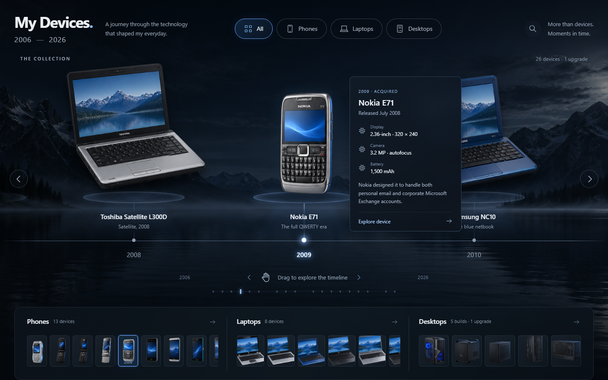
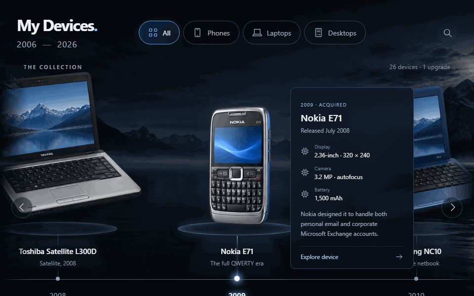

# Devices Over Time

A visual, browsable timeline of every phone, laptop and PC I've owned since 2006 — built as a static, dependency-free web app for anyone curious how one person's personal tech evolved over 20 years.

**Live:** https://devices-over-time.pages.dev

## Preview





The GIF shows the actual deployed app: category filtering (All / Phones / Laptops / Desktops), the draggable year timeline, and the detail dialog with overview/specifications/benchmarks tabs.

## What it is

- 13 phones, 8 laptops, 5 desktop builds and one linked CPU upgrade (26 devices, 1 upgrade), spanning 2006–2026.
- A chronological timeline with mouse dragging, touch scrolling, arrow and keyboard navigation, and a year overview strip.
- Category filters, searchable device names/specs, thumbnail navigation, hover previews, and accessible click/tap detail dialogs (overview, specifications, benchmarks tabs).
- Responsive mobile layout and reduced-motion support.
- Fully static: no backend, no database, no runtime secrets.

## Architecture and stack

- Vanilla JavaScript (ES modules), no framework, no build-time dependencies. `src/main.js` drives interaction and rendering, `src/data.js` is the full typed device inventory, `src/art.js` maps devices to illustration-atlas cells, `src/styles.css`/`type.css` handle layout and typography.
- `scripts/serve.mjs` is a zero-dependency dev/preview server (`npm run dev`, `npm run preview`).
- `scripts/build.mjs` produces `dist/`: it copies `index.html`, `src/` and `assets/`, verifies the inventory count (27 total milestones) and that all four illustration atlases are present and non-empty, then writes security/caching headers (`_headers`) and `robots.txt`.
- Device and scenery artwork is served as CSS-cropped sprite atlases (`assets/phones.png`, `laptops.png`, `desktops.png`, `backdrop.png`) rather than per-device image files.
- Deployed on Cloudflare Pages (GitHub-connected, production branch `main`, build `npm run build`, output `dist`, Node.js 22) — see `docs/deployment.md` for the full publication record, including verified browser checks on both desktop and mobile.

## Quality evidence

- `npm test` runs `tests/inventory.test.mjs` (Node's built-in test runner) against `docs/model-research.md`, the authoritative inventory. It checks that every ownership row appears exactly once with the correct acquisition date, that the 2022 CPU upgrade stays linked to its 2021 build rather than counted as a separate PC, that unusual/deliberately-unknown configurations survive intact, and that every device has a mapped illustration plus a sourced price/benchmark where one is claimed. All 4 checks currently pass.
- There is no CI workflow configured in this repository (no `.github/workflows`) — tests are run locally before deploys, and `docs/deployment.md` records the manual browser verification (15 checks: filters, search, no-results state, recorded specs, benchmark context, related upgrades, navigation boundaries, keyboard movement, focus handling, mobile overflow, drag behaviour) performed against both localhost and the live site before each publish.

## Setup and testing

Requires Node.js 22+. No dependencies, no install step.

```bash
npm run dev      # http://localhost:4173
npm test         # inventory checks against docs/model-research.md
npm run build    # writes dist/
npm run preview  # serves dist/
```

## Data and image provenance

This section states explicitly, in one place, the provenance rules the project already follows in `docs/model-research.md` and `docs/image-prompts.json` — reworded for a reader landing on the README, not changed in substance:

- **Ownership data.** `docs/model-research.md` is the single authoritative source for which devices were owned, when, and in what configuration. `src/data.js` is derived from it, never the other way round — the document is updated first, then the data file. Acquisition dates are the user's personal ownership dates, not product release dates, and the two are kept clearly separate throughout the app.
- **Unrecorded details stay unrecorded.** Where a configuration detail was not noted at the time, it is marked "not recorded" rather than being filled in from a manufacturer's stock specification. Model names, acquisition dates and confirmed configurations are not changed without a new correction from the device owner.
- **Prices and benchmarks are reference data, not personal claims.** Listed prices keep their original market and currency and link to a source; benchmark figures identify the test, source and review configuration used. Neither is presented as something measured on, or paid for, the actual personally-owned unit.
- **Artwork is disclosed AI-generated illustration, not photography.** All device and scenery imagery (`assets/*.png`) is AI-generated illustration produced from the prompts and reference links recorded in `docs/image-prompts.json` — it is not photography of the owner's actual hardware, and the deployed app itself labels device images as "reference illustration." The three device atlases are rendered as CSS-cropped sprite cells; the 2022 CPU upgrade intentionally reuses its original 2021 case illustration rather than generating a new one.
- No purchase prices, personal benchmarks or anecdotes are invented anywhere in the app; everything shown is either the owner's own ownership record or a sourced, clearly-labelled external reference.

## Limitations and status

- This is a finished, actively-maintained personal project, not a general-purpose product — the inventory is one person's device history and isn't meant to be user-editable.
- Some historical configurations (e.g. the exact HP Pavilion dv6000, Toshiba Satellite L300D and Acer TimelineX 4820T builds) are deliberately incomplete because the original specs were never recorded; this is intentional per the data rules above, not a bug.
- Custom domain (`devices.harryjameschapman.com`) setup is documented in `docs/deployment.md` but depends on a DNS record the Cloudflare Pages API session cannot set itself — the live URL above (`devices-over-time.pages.dev`) is the current canonical link until that CNAME is added.
- There is no automated CI; verification is manual (`npm test` plus the browser check list in `docs/deployment.md`) before each deploy.

## Repository layout

```
index.html            Entry point
src/                   main.js, data.js, art.js, styles.css, type.css
assets/                Illustration atlases + favicon
scripts/                build.mjs, serve.mjs (zero-dependency)
tests/                  inventory.test.mjs
docs/                   model-research.md, image-prompts.json, project-brief.md, deployment.md
```

## Cloudflare Pages

The GitHub-connected Cloudflare Pages project is `devices-over-time`, with production branch `main`, build command `npm run build`, output directory `dist`, and Node.js 22. This is entirely static and needs no database, paid software, Functions, or runtime secrets. The build supplies security and caching headers.

Target custom hostname: `devices.harryjameschapman.com`. Register the hostname on this Pages project before creating its CNAME to the project's assigned `pages.dev` address. Keep the portfolio project and apex records unchanged.

For an authorized direct deployment: `npx wrangler pages deploy dist --project-name devices-over-time --branch main`.
